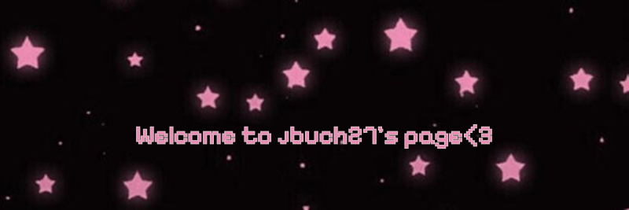

    
       
    
    

<table align="right">
 <tr><td>🇺🇸 English</td></tr>
 <tr><td>🇪🇸 Español</td></tr>
</table>

<h2>:busts_in_silhouette: How to reach me</h2>

  

<h2>:hammer_and_wrench: Languages & Tools</h2>

